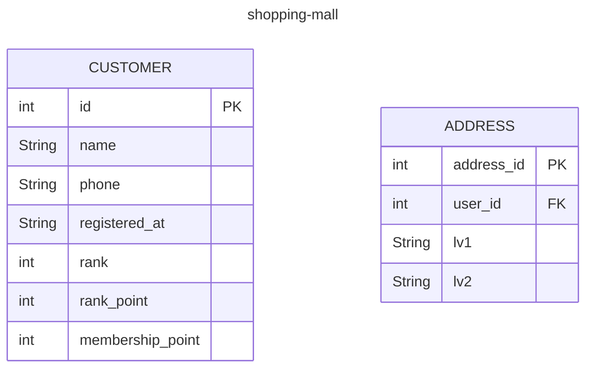

참고할 글
1. 백앤드 구축 로드맵
https://planbs.tistory.com/entry/%EB%B0%B1%EC%97%94%EB%93%9C%EA%B0%80-%EC%9D%B4%EC%A0%95%EB%8F%84%EB%8A%94-%ED%95%B4%EC%A4%98%EC%95%BC-%ED%95%A8-3-%EA%B0%9C%EB%B0%9C-%ED%94%84%EB%A1%9C%EC%84%B8%EC%8A%A4-%EC%A0%95%EB%A6%BD
2. JWT
https://velopert.com/2389
3. DB 구조 설계

## 버전 관리 시스템
git

## 이슈 트래킹
GitHub

## API 설계 원칙
http

## 직렬화 방식
JSON

## 사용자 인증 방식
Authorizaton 헤더
인증 스키마:
JWT을 사용하는 Bearer

## server API 및 DB구조 정리

머메이드 라이브 에디터
https://mermaid.live/edit#pako:eNpVjk2Lg0AMhv9KyGkL9Q94WGh1t5fCFurN6SFo7AztfDBGpKj_fcd62c0pvM_zhkzY-JYxx-7px0ZTFKhK5SDNoS50NL1Y6m-QZZ_ziQWsd_ya4fhx8tBrH4Jx993mH1cJium8agyijXssGyre_R_HM5T1mYL4cPtLqtHP8FWbi07n_xMdObW-647yjrKGIhQU3wru0XK0ZNr0_rQmCkWzZYV5WlvuaHiKQuWWpNIg_vpyDeYSB97jEFoSLg3dI9ktXH4B_cJWqwhttps://mermaid.live/edit#pako:eNpVjk2Lg0AMhv9KyGkL9Q94WGh1t5fCFurN6SFo7AztfDBGpKj_fcd62c0pvM_zhkzY-JYxx-7px0ZTFKhK5SDNoS50NL1Y6m-QZZ_ziQWsd_ya4fhx8tBrH4Jx993mH1cJium8agyijXssGyre_R_HM5T1mYL4cPtLqtHP8FWbi07n_xMdObW-647yjrKGIhQU3wru0XK0ZNr0_rQmCkWzZYV5WlvuaHiKQuWWpNIg_vpyDeYSB97jEFoSLg3dI9ktXH4B_cJWqw

|summary|URI|Request Header|Params|Request Body|Success Code|Response Header|Response Body|
|---|---|---|---|---|---|---|---|
|---|---|---|---|---|---|---|---|
|---|---|---|---|---|---|---|---|
